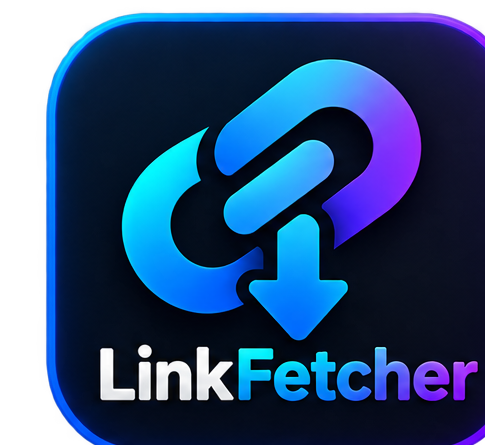

<p align="center">
  
</p>

<h1 align="center">LinkFetcher</h1>

<p align="center">
  Desktop media downloader powered by <strong>yt-dlp</strong> + <strong>ffmpeg</strong>.<br />
  Queue, 4K video, audio, thumbnails, cut sections, subtitles, SponsorBlock — for Windows & Linux.
</p>

## Features

- 🔗 Paste-a-link analyzer with format / resolution / codec picker
- 🎞 Video up to 4K, 🎵 audio-only extraction, 🖼 thumbnails & image URLs
- ✂ Section cuts (downloads full stream, cuts locally in seconds)
- 💬 Manual + auto subtitles, optional muxing (mp4/mkv)
- 🍪 Per-item or global browser cookies to bypass YouTube bot checks (403)
- ⏱ SponsorBlock skipping, FPS cap, speed limit, concurrent downloads
- ⭐ Favorites, download-later queue, backup export/import
- 🌍 English + Português, 4 themes (dark, gray, beige, white)

## Install

Download the installer from [Releases](../../releases):

| OS      | File                        |
|---------|-----------------------------|
| Linux   | `LinkFetcher_*_amd64.deb` (also AppImage) |
| Windows | `LinkFetcher_*_x64-setup.exe`             |

> On first launch the app downloads official yt-dlp + ffmpeg binaries (~190 MB, one time only) and verifies them by hash before use.

## Development

Requirements: Node 20+, Rust stable, Tauri v2 system deps ([guide](https://v2.tauri.app/start/prerequisites/)).

```bash
npm install
npm run tauri:dev     # dev with hot-reload (frontend :1420)
npm run lint          # tsc --noEmit, must be clean
```

```bash
# binary setup / checks (Rust)
cargo check   # from src-tauri/
cargo test    # unit tests (args, parsers, error cleanup)
```

```bash
npx tauri build --bundles deb   # Linux .deb (see tauri.conf.json for all targets)
```

### Stack

| Layer   | Tech                                                        |
|---------|-------------------------------------------------------------|
| UI      | React 19 + TypeScript (strict) + Vite 6 + Tailwind CSS 4    |
| Shell   | Tauri v2 (Rust; WebView2 on Windows, WebKitGTK on Linux)    |
| Engine  | yt-dlp + ffmpeg (fetched on first run, SHA-verified)        |

## License

[Apache-2.0](https://www.apache.org/licenses/LICENSE-2.0)
